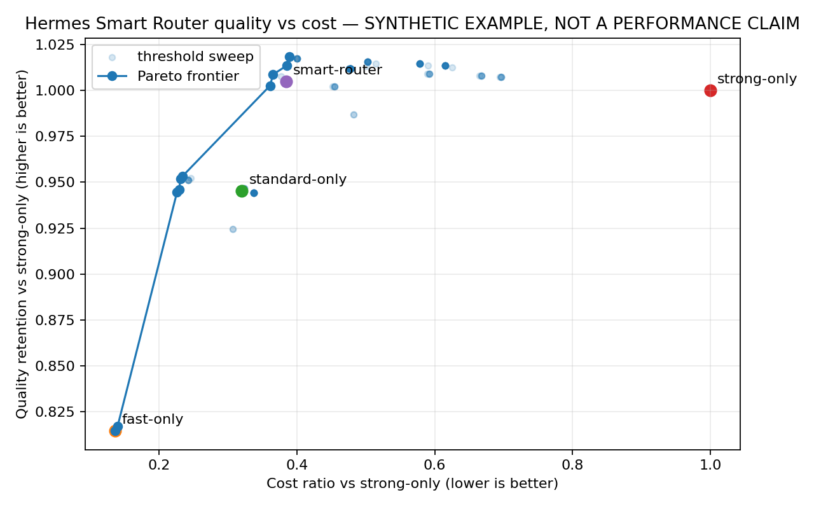
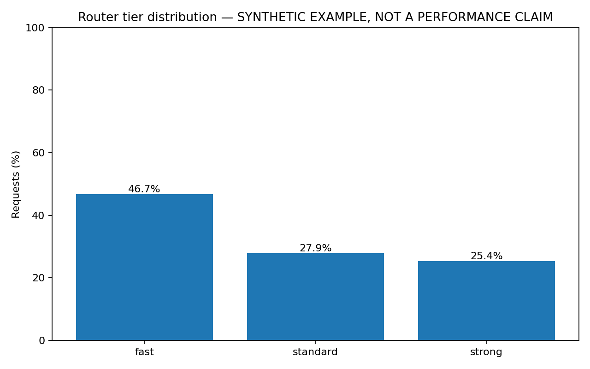
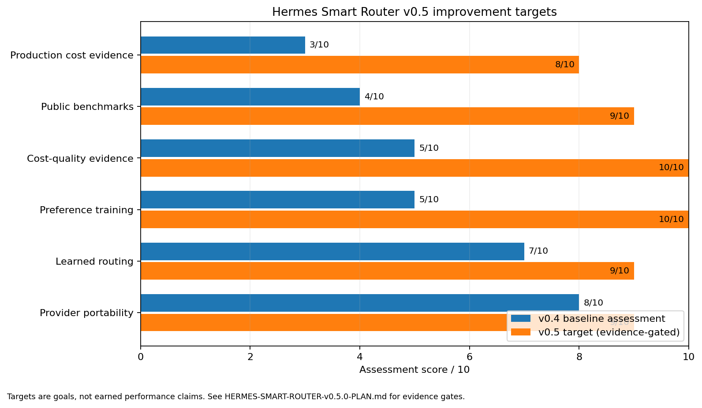
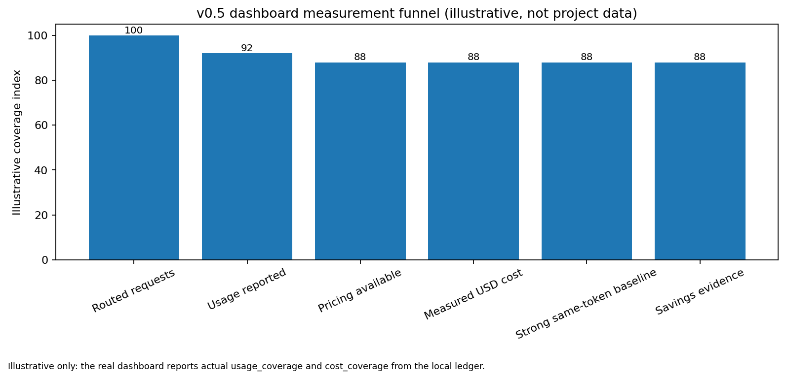

# Hermes Linux Stack — 9router + Smart Router v0.5.0

A self-hosted Linux stack for running **Hermes Agent**, its **Telegram bot/agent**, **Open WebUI**, optional **n8n**, and secure execution tooling behind **Hermes Smart Router v0.5.0** and **9router**.

> This is the **9router branch**.
>
> `main` must not contain OmniRoute runtime configuration.

## Architecture

```text
Telegram API
     ↑
     │ outbound polling
     │
Hermes Telegram Agent
     │
     ▼
Hermes Agent ───────────────┐
                            │
Open WebUI ─────────────────┼──► Hermes Smart Router v0.5.0
                            │              │
n8n / other clients ────────┘              │
                                           ├─ fast     → combo-fast
                                           ├─ standard → combo-standard
                                           └─ strong   → combo-strong
                                                  │
                                                  ▼
                                               9router
                                                  │
                                                  ▼
                                         Providers / Models
```

Telegram is handled by the Hermes gateway. It is not a separate Docker service: Hermes polls the Telegram Bot API and serves allowed Telegram users through the same agent/runtime used by the rest of the stack.

## Branch policy

The repository intentionally keeps its routing backends separate.

### `main`

```text
Hermes / Telegram / Open WebUI / n8n
                  │
                  ▼
          Smart Router v0.5.0
                  │
                  ▼
               9router
                  │
                  ▼
              Providers
```

### `hermes-omniroute-linux-stack`

```text
Hermes / Telegram / Open WebUI / n8n
                  │
                  ▼
          Smart Router v0.5.0
                  │
                  ▼
              OmniRoute
                  │
                  ▼
              Providers
```

Do not add OmniRoute to `main`, and do not add 9router to the OmniRoute branch.

---

## Features

- Hermes Agent running in Docker
- Telegram bot/agent integration through Hermes
- Numeric Telegram user allowlist
- Optional Telegram home chat for cron results and notifications
- Hermes Smart Router v0.5.0
- OpenAI-compatible `auto` routing aliases
- 9router provider/model gateway
- Open WebUI integration
- Optional n8n integration
- Optional Caddy reverse proxy
- Optional Hermes dashboard and OpenAI-compatible API
- Persistent state under `data/`
- Non-root and read-only Smart Router runtime
- Optional approval-gated Docker, SSH, and sandbox execution
- Dedicated Telegram approval bot support for privileged execution workflows
- Local-only service bindings by default where appropriate

---

# Requirements

- Linux
- Bash
- Docker Engine
- Docker Compose plugin
- Git
- A Telegram BotFather token if Telegram is enabled
- At least one AI provider configured through 9router

Check Docker:

```bash
docker version
docker compose version
```

---

# Installation

Clone the repository:

```bash
git clone https://github.com/Afsharidevops/hermes-linux-stack.git
cd hermes-linux-stack
git switch main
```

Make the scripts executable:

```bash
chmod +x install.sh manage.sh
```

Run the installer:

```bash
./install.sh
```

The installer guides you through the selected services and configuration.

Depending on your choices it can configure:

- 9router
- Hermes Agent
- Telegram
- Smart Router
- Open WebUI
- n8n
- Hermes dashboard/API
- optional execution capabilities
- optional Caddy/public access

---

# Telegram Agent

Telegram is a first-class Hermes interface in this stack.

The runtime path is:

```text
Telegram user
     │
     ▼
Telegram Bot API
     │
     ▼
Hermes gateway
     │
     ▼
Smart Router
     │
     ▼
9router
     │
     ▼
Provider / Model
```

## Initial Telegram setup

During installation, enable Telegram when prompted.

You will be asked for:

1. your Telegram BotFather token
2. one or more allowed numeric Telegram user IDs
3. an optional Telegram home chat ID

The bot token and Telegram configuration are stored under the Hermes runtime data rather than committed to Git.

Do not use Telegram usernames as authorization values.

Use numeric Telegram IDs.

A common way to discover your numeric ID is through a Telegram user-ID bot such as `@userinfobot`.

## Test Telegram

After startup, open the bot and send:

```text
/start
```

If a home chat has not been configured, you can set one from the intended chat with:

```text
/sethome
```

The home chat can receive cron output and cross-platform notifications.

## Show allowed Telegram users

```bash
./manage.sh show-telegram-users
```

## Add a Telegram user

```bash
./manage.sh add-telegram-user 123456789
```

## Replace the complete allowlist

```bash
./manage.sh set-telegram-users 123456789,987654321
```

The Hermes service is recreated automatically when the managed Telegram allowlist changes.

## Telegram troubleshooting

Check Hermes logs:

```bash
./manage.sh logs hermes
```

Verify:

- the BotFather token is valid
- allowed users are numeric IDs
- the server has outbound DNS
- the server can reach Telegram over HTTPS
- no second Hermes gateway is using the same bot token

---

# Smart Router v0.5.0

Published image:

```text
afsharidevops/hermes-smart-router:0.5.0
```

The Smart Router decides:

> What capability tier does this request need?

9router then handles:

> Which provider/model should serve that target?

No additional LLM call is required to make the routing decision.

## Request path

```text
model=auto
    │
    ▼
Smart Router
    │
    ├─ fast     → combo-fast
    ├─ standard → combo-standard
    └─ strong   → combo-strong
                       │
                       ▼
                    9router
```

## OpenAI-compatible aliases

Smart Router exposes:

```text
auto
auto-fast
auto-standard
auto-strong
```

These appear through:

```text
GET /v1/models
```

Applications can simply request:

```json
{
  "model": "auto"
}
```

## Default 9router tier mappings

```env
SMART_ROUTER_FAST_MODEL=combo-fast
SMART_ROUTER_STANDARD_MODEL=combo-standard
SMART_ROUTER_STRONG_MODEL=combo-strong
```

These mappings are intentionally different from the OmniRoute branch.

## Routing modes

### Observe

```env
SMART_ROUTER_MODE=observe
```

Recommended for initial deployment.

Smart Router evaluates automatic requests and records routing observations while preserving the configured observation path.

### Route

```env
SMART_ROUTER_MODE=route
```

Automatic requests are actively rewritten to the selected tier.

Change mode through the supported management command:

```bash
./manage.sh set-router-mode observe
```

or:

```bash
./manage.sh set-router-mode route
```

## Capability defaults

| Tier | Tools | Vision | Context |
|---|---:|---:|---:|
| Fast | No | No | 32k |
| Standard | Yes | No | 128k |
| Strong | Yes | Yes | 200k |

Capability gates take priority over ordinary routing scores.

## Output budgets

Default automatic-request budgets:

```env
SMART_ROUTER_FAST_MAX_TOKENS=1024
SMART_ROUTER_STANDARD_MAX_TOKENS=4096
SMART_ROUTER_STRONG_MAX_TOKENS=6144
```

## Sticky sessions

Defaults:

```env
SMART_ROUTER_SESSION_TTL_SECONDS=2700
SMART_ROUTER_MAX_SESSION_AGE_SECONDS=43200
SMART_ROUTER_DEMOTION_TURNS=5
```

These settings reduce unnecessary model/tier switching during conversations.

---

# 9router

9router is the provider/model delivery layer for this branch.

Default host dashboard:

```text
http://127.0.0.1:20128
```

Internal Docker API URL:

```text
http://nine-router:20128/v1
```

Smart Router must use:

```env
SMART_ROUTER_UPSTREAM_BASE_URL=http://nine-router:20128/v1
```

Never use `localhost` for Smart Router → 9router communication inside Docker.

Configure your providers and the following default combos in 9router as appropriate:

```text
combo-fast
combo-standard
combo-strong
```

---

# Hermes and Smart Router

When Smart Router is enabled, Hermes should use an automatic model and the internal Smart Router endpoint.

Typical effective configuration:

```yaml
default: auto
base_url: http://smart-router:8080/v1
```

Telegram `/model` should therefore reflect the automatic routing model rather than a hard-coded provider model.

---

# Open WebUI

When Smart Router is enabled, Open WebUI should connect to:

```text
http://smart-router:8080/v1
```

This gives Open WebUI access to:

```text
auto
auto-fast
auto-standard
auto-strong
```

as well as upstream models exposed through the router.

Default host port:

```text
http://127.0.0.1:3000
```

If you intentionally bind Open WebUI to your LAN, restrict the port to trusted networks.

For localhost-only deployment, an SSH tunnel can be used:

```bash
ssh -L 3000:127.0.0.1:3000 user@server
```

Then open:

```text
http://localhost:3000
```

---

# n8n

n8n is optional.

Default port:

```text
127.0.0.1:5678
```

The stack supports managed n8n MCP integration modes.

Useful commands include:

```bash
./manage.sh set-n8n-mcp-mode instance
./manage.sh set-n8n-mcp-mode trigger
./manage.sh set-n8n-mcp-mode off
./manage.sh bootstrap-n8n
./manage.sh reconcile-n8n
./manage.sh verify-n8n
```

For trigger mode:

```bash
./manage.sh rotate-n8n-trigger-token
```

For instance-level MCP authentication:

```bash
./manage.sh set-n8n-instance-mcp-token
```

---

# Management

Interactive menu:

```bash
./manage.sh menu
```

Common operations:

```bash
./manage.sh start
./manage.sh stop
./manage.sh restart
./manage.sh update
./manage.sh status
./manage.sh doctor
./manage.sh configure
```

Logs:

```bash
./manage.sh logs
./manage.sh logs hermes
./manage.sh logs 9router
./manage.sh logs smart-router
./manage.sh logs webui
./manage.sh logs n8n
./manage.sh logs caddy
```

Restart Hermes:

```bash
./manage.sh restart-hermes
```

Change Smart Router mode:

```bash
./manage.sh set-router-mode observe
./manage.sh set-router-mode route
```

---

# Optional Secure Execution

Execution capabilities are disabled until explicitly configured.

Supported capability groups include:

```text
sandbox
ssh
docker
```

Check state:

```bash
./manage.sh execution-status
```

Enable only what you need:

```bash
./manage.sh enable-execution sandbox
./manage.sh enable-execution ssh
./manage.sh enable-execution docker
```

Disable:

```bash
./manage.sh disable-execution sandbox
```

## Dedicated Telegram approval bot

Privileged execution approval should use a second BotFather bot dedicated to approvals.

Do not reuse the main Hermes Telegram bot.

Configure it with:

```bash
./manage.sh set-execution-approval-bot-token
```

Execution users must be a subset of the normal Telegram allowlist:

```bash
./manage.sh set-execution-users 123456789
```

This keeps routine Telegram chat separate from privileged execution approval.

---

# Service Ports

Typical defaults:

| Service | Address |
|---|---|
| 9router | `127.0.0.1:20128` |
| Open WebUI | `127.0.0.1:3000` |
| Hermes API | `127.0.0.1:8642` |
| Hermes dashboard | `127.0.0.1:9119` |
| n8n | `127.0.0.1:5678` |
| Smart Router | Docker network only |

Telegram uses outbound polling and does not require an inbound Telegram port.

---

# Data and Secrets

Persistent runtime data lives beneath:

```text
data/
```

Important locations include:

```text
data/9router/
data/hermes/
data/open-webui/
data/n8n/
data/smart-router/
data/stack-secrets/
```

Sensitive configuration includes:

```text
.env
data/hermes/.env
data/smart-router/
data/stack-secrets/
```

Never commit runtime secrets or databases.

The Smart Router runtime directory is intentionally ignored by Git.

---

# Smart Router Security

The Smart Router container uses a hardened runtime:

- non-root UID `10001`
- read-only root filesystem
- dropped capabilities
- `no-new-privileges`
- temporary `/tmp`
- writable runtime `/data`
- read-only policy mount

`smart-router-init` prepares the host-backed runtime directory for UID `10001`.

---

# Validation

Validate Compose:

```bash
docker compose \
  --env-file .env \
  config
```

Check services:

```bash
./manage.sh status
```

Run diagnostics:

```bash
./manage.sh doctor
```

Run Smart Router tests from a development environment:

```bash
python -m pip install -e "./smart-router[dev]"
pytest -q smart-router/tests
```

Smart Router v0.5.0 currently passes the repository test suite covering API routing, model aliases, passthrough behavior, SSE preservation, and policy behavior.

---

# Smart Router Health

From inside the container:

```bash
docker exec hermes-smart-router \
  python -c 'import urllib.request; print(urllib.request.urlopen("http://127.0.0.1:8080/health").read().decode())'
```

Expected version:

```json
{
  "status": "ok",
  "version": "0.5.0"
}
```

Inspect aliases:

```bash
docker exec hermes-smart-router \
  python -c 'import urllib.request; print(urllib.request.urlopen("http://127.0.0.1:8080/v1/models").read().decode())'
```

---

# Troubleshooting

## Telegram does not respond

```bash
./manage.sh logs hermes
```

Check the token, numeric allowlist, outbound network access, and duplicate bot sessions.

## Smart Router cannot reach 9router

The upstream must be:

```text
http://nine-router:20128/v1
```

## Smart Router is unhealthy

```bash
docker logs --tail=200 hermes-smart-router
```

## 9router is unhealthy

```bash
./manage.sh logs 9router
```

## Open WebUI shows no models

Verify:

1. Smart Router is healthy.
2. 9router has the expected combos/models.
3. Open WebUI uses `http://smart-router:8080/v1`.
4. The relevant API key is valid.

---

# Published Smart Router Image

```text
afsharidevops/hermes-smart-router:0.5.0
```

Platforms:

```text
linux/amd64
linux/arm64
```

OCI release digest:

```text
```

---

# Design Principles

1. Telegram is a first-class Hermes interface.
2. Smart Router decides request capability tier.
3. 9router handles provider/model delivery.
4. No extra routing LLM call is required.
5. Capability requirements override normal tier scoring.
6. Explicit model requests stay explicit.
7. Automatic routing uses `combo-fast`, `combo-standard`, and `combo-strong`.
8. Runtime secrets stay outside Git.
9. Privileged execution requires explicit enablement and approval.
10. 9router and OmniRoute remain in separate branches.

---

# Current Branch State

```text
Branch: main
    Smart Router: v0.5.0
Backend: 9router
Smart Router upstream: http://nine-router:20128/v1

Fast:     combo-fast
Standard: combo-standard
Strong:   combo-strong

Recommended initial router mode: observe
```


## Smart Router v0.5.0 release hardening

The v0.5.0 release keeps the learned classifier as a proposal layer and preserves deterministic capability, sticky-session, budget, explicit-model, streaming, privacy, and fail-open rules. The safe default remains `SMART_ROUTER_MODE=observe` with `SMART_ROUTER_POLICY=heuristic`.

Branch backend: **9router**

```env
SMART_ROUTER_UPSTREAM_BASE_URL=http://nine-router:20128/v1
SMART_ROUTER_UPSTREAM_HEALTH_URL=http://nine-router:20128/api/health
SMART_ROUTER_FAST_MODEL=combo-fast
SMART_ROUTER_STANDARD_MODEL=combo-standard
SMART_ROUTER_STRONG_MODEL=combo-strong
```

The shared v0.5.0 image is `afsharidevops/hermes-smart-router:0.5.0`. `SMART_ROUTER_HMAC_SECRET` is mandatory; generate a persistent secret with `openssl rand -hex 32` and keep the real value outside Git. Use `SMART_ROUTER_*_MAX_CONTEXT` for context limits.

For external OpenAI-compatible applications, see `docs/SMART-ROUTER-CLIENT-API.md`. For standalone TLS or an external Caddy/Nginx/Traefik/other reverse proxy, see `docs/SMART-ROUTER-PUBLIC-INGRESS.md`.

Learned rollout remains: heuristic+observe → collect safe features → train/evaluate → learned+observe → validate → learned+route. Do not publish cost/quality claims until measured on a representative workload.

## License

See `LICENSE`.

Third-party images and upstream projects retain their respective licenses.


<!-- smart-router-v0.4.0-release -->
## Smart Router v0.5.0 measurement and release hardening

Smart Router v0.4.0 adds RouteLLM-style cost/quality benchmarking with Pareto plots, fixed baselines, tier distribution, confusion matrix, confidence-risk analysis, machine-readable summaries, and CI release gates. Synthetic example figures are explicitly watermarked and are not performance claims. See [`docs/SMART-ROUTER-v0.4.0-BENCHMARKING.md`](docs/SMART-ROUTER-v0.4.0-BENCHMARKING.md).

Client tier forcing is disabled by default, approximate context counts receive a configurable 15% safety margin, and the unused `SMART_ROUTER_FAIL_OPEN_MODEL` knob has been removed. The shared Docker image is released canonically from `main` only after `smart-router/` is identical on `main` and `hermes-omniroute-linux-stack`.

The v0.4.0 benchmark artifacts are retained as historical, reproducible validation evidence. They are synthetic results and are not production-cost claims.


<!-- smart-router-v0.5.0-release -->
## Smart Router v0.5.0 — measured cost, preferences, and a built-in dashboard

Smart Router v0.5.0 adds a lightweight dashboard directly to the router at **`/dashboard`**. It records measured upstream token usage to a local SQLite ledger and, when real tier prices are configured, shows measured USD cost, a same-token strong-only counterfactual, savings percentage, usage/pricing coverage, tier mix, and output-budget-cap reduction. Missing usage is never silently converted into fake savings.

Configure real prices by copying `smart-router/policy/pricing-v0.5.example.json` to `pricing-v0.5.json`. See [`docs/HERMES-SMART-ROUTER-v0.5.0-PLAN.md`](docs/HERMES-SMART-ROUTER-v0.5.0-PLAN.md) and [`docs/SMART-ROUTER-v0.5.0-DASHBOARD.md`](docs/SMART-ROUTER-v0.5.0-DASHBOARD.md).

### Evidence figures

The following v0.4 benchmark figures remain **synthetic examples, not production performance claims**:





The v0.5 target scorecard is a roadmap figure, not measured performance:




