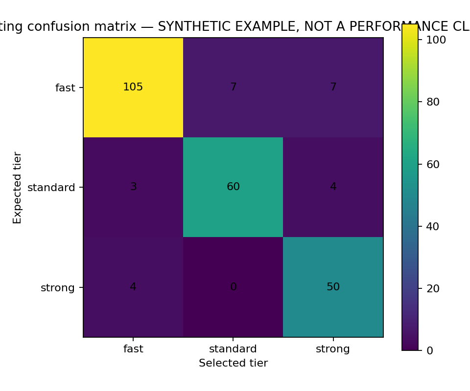
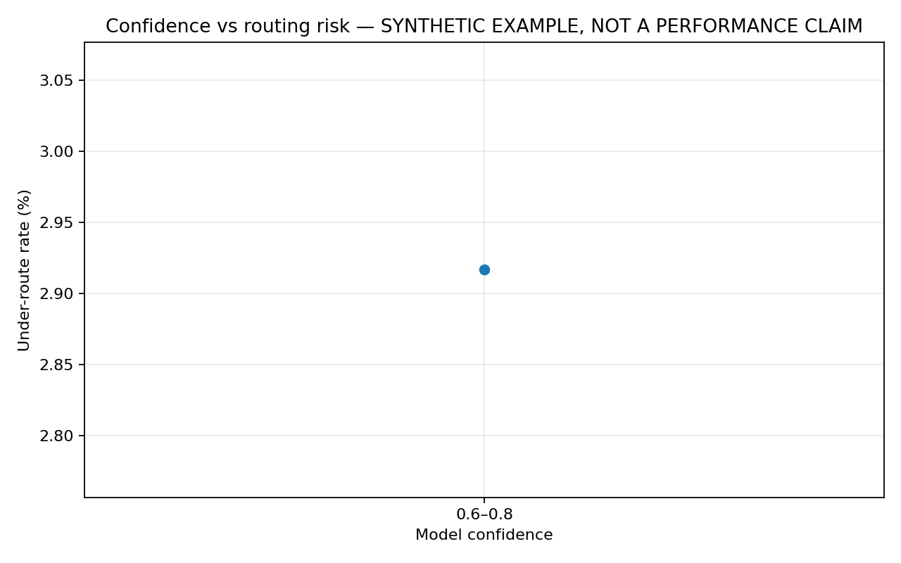

# Hermes Smart Router v0.4.0 benchmark report

> **Synthetic example only. This report is not a performance claim for Hermes Smart Router.**

- Input: `/mnt/data/hermes_v040_work/common/overlay/smart-router/examples/benchmark-synthetic-v0.4.0.jsonl`
- Rows: **240**
- Cost model: **normalized_tier_weight**
- Quality mode: **measured_response_quality**
- Note: Measured response-quality scores were supplied for every tier on every row.

## Headline metrics

| Strategy | Quality retention | Cost vs strong-only | Cost savings | Exact agreement | False-fast | Under-route | Strong over-route |
| --- | ---: | ---: | ---: | ---: | ---: | ---: | ---: |
| fast-only | 81.45% | 13.63% | 86.38% | 45.83% | 47.50% | 48.33% | 2.92% |
| standard-only | 94.54% | 32.04% | 67.96% | 27.08% | 0.00% | 22.50% | 2.92% |
| strong-only | 100.00% | 100.00% | 0.00% | 22.50% | 0.00% | 0.00% | 77.50% |
| smart-router | 100.49% | 38.46% | 61.54% | 89.58% | 2.92% | 2.92% | 4.58% |

## Router tier mix

- fast: **46.67%**
- standard: **27.92%**
- strong: **25.42%**

## Figures

## Pareto sweep

Generated **10** non-dominated threshold points. See `frontier.csv`.

## Release gates

- ✅ All configured gates passed.

## Publishing guidance

For public claims, use a representative held-out workload, disclose the grading method and cost configuration, report confidence intervals where possible, and retain this report plus `summary.json` as release evidence.
